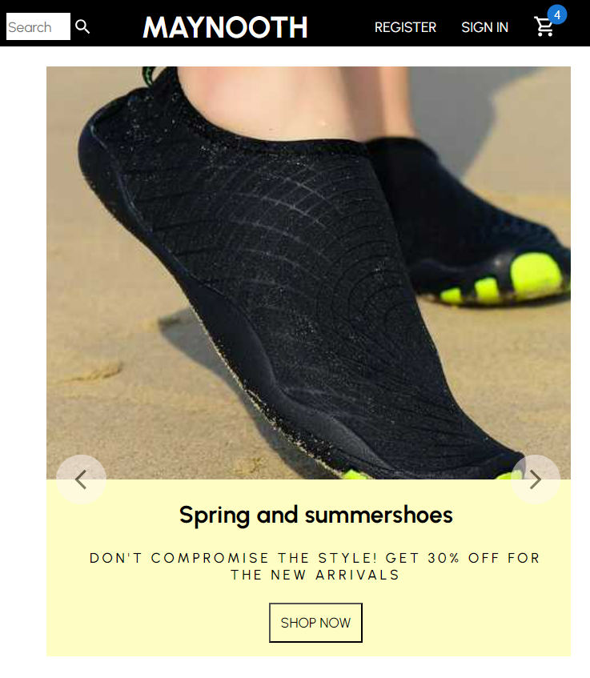

# Frontend Test VIIO - Maynooth ecommerce React

This is a solution for the Frontend test for the VIIO company.

## Table of contents

- [Overview](#overview)
  - [The functionality](#the-functionality)
  - [Screenshot](#screenshot)
  - [Links](#links)
- [My process](#my-process)
  - [Built with](#built-with)
- [Author](#author)

## Overview

### The functionality

Users should be able to:

- View the optimal layout for the app depending on their device's screen size
- See hover states for all interactive elements on the page
- Login and register
- Navigate to the site pages (home, login, register, cart, protuct, produts, categories)

### Screenshot

Some view sreenshots:

- SLIDE (MOBILE)

- CATEGORIES (TABLET)

- LAST PRODUCT - FOOTER (MOBILE)

### Links

- Solution URL: [Maynooth ecommerce React](https://github.com/danielaser/Maynooth-ecommerce-react)

## My process

### Built with

- React
- CSS custom properties
- Flexbox
- Mobile-first workflow
- Javascript
- [Styled Components](https://styled-components.com/) - For styles

## Author

- Website - [Daniela Serrano](https://github.com/danielaser)
- GitHub - [@danielaser](https://github.com/danielaser)
